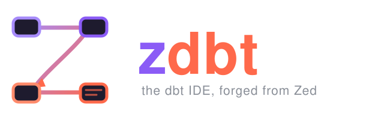

<p align="center">
  
</p>

**zdbt** is a personal **dbt IDE** built as a fork of [Zed](https://zed.dev)
([zed-industries/zed](https://github.com/zed-industries/zed), forked at tag
`v1.17.2`). It adds first-class, native dbt support directly into the editor —
no webviews, all GPUI.

> This project is not affiliated with or endorsed by Zed Industries or dbt
> Labs. "Zed" and "dbt" are trademarks of their respective owners.

## Download

Prebuilt, unsigned binaries are on the
[releases page](https://github.com/arezki1990/dbt-zed/releases/latest) —
macOS Apple Silicon `.dmg`, Linux x86_64 `.tar.gz`, Windows x86_64 installer —
and the project site is at
[arezki1990.github.io/dbt-zed](https://arezki1990.github.io/dbt-zed/).
Builds use the `dev` release channel, so they install alongside official Zed
and never auto-update over it. On macOS, right-click → Open the first time
(the build is unsigned).

## Features

- **`dbt SQL` language** — Jinja-aware SQL highlighting via a Jinja host
  grammar with combined SQL injection; the default for all `.sql` files.
- **Language server** — prefers dbt Fusion's `dbt lsp` (go-to-definition,
  hover, completions, diagnostics), falls back to the community Go
  [`dbt-language-server`](https://github.com/j-clemons/dbt-language-server)
  with auto-download. Includes a workaround for a Fusion LSP bug where the
  server exits on `workspace/didChangeConfiguration`.
- **dbt results panel** (bottom dock):
  - Run the current model or a **selected SQL chunk** with `cmd+enter`
    (`dbt show`, Jinja compiled), results in a data grid with sorting,
    live search, column show/hide, smooth resizable columns, pinned row
    numbers, horizontal scrolling, and CSV export.
  - **Compiled SQL** view in a read-only, syntax-highlighted editor.
  - **Interactive lineage graph** — React-Flow-style canvas: layered layout
    with crossing reduction, materialization colors, per-node collapse
    handles, node dragging, whole-graph panning, semantic zoom with scaling
    text, column-level lineage with click-to-highlight transformation paths,
    and a collapsible upstream/downstream tree. Backed by a
    [`sqlitegraph`](https://crates.io/crates/sqlitegraph) database built from
    `target/manifest.json` + `catalog.json`.
  - **Browse-driven**: opening any model recenters the lineage; clicking
    graph nodes opens files.
- **Project automation** — auto-discovers nested dbt projects
  (`dbt_project.yml` anywhere in the repo), in-project profiles
  (`local_profiles/`, `profiles/`, `.dbt/`), `.env`/`.env.local` files up to
  the repo root (loaded only into the dbt process environment), and runs
  `dbt parse` + `dbt compile --write-catalog` on first open.
- **Settings page** — a "dbt" page in Zed's settings UI: show limit, dbt
  binary, target, profiles dir, project dir, env file, parse-on-load, and
  lineage depth/node caps.

## Requirements

- macOS (Apple Silicon tested), Rust via rustup, `cmake`.
- A user-installed **dbt**: [dbt Fusion](https://docs.getdbt.com) (recommended)
  or dbt Core + the Go language server. dbt is **not** bundled or
  redistributed by this project; it runs from your `PATH` under dbt Labs'
  own license.

## Building

```sh
cargo build -p zed --features gpui_platform/runtime_shaders
ZED_RELEASE_CHANNEL=dev ./target/debug/zed /path/to/your/dbt/project
```

(`runtime_shaders` avoids requiring the Xcode Metal offline toolchain.)

Upstream build docs: [macOS](./docs/src/development/macos.md),
[Linux](./docs/src/development/linux.md),
[Windows](./docs/src/development/windows.md).

## License

Like upstream Zed, this repository is licensed **GPL-3.0** — see
[LICENSE-GPL](LICENSE-GPL) — with Apache-2.0 components where marked
(see [LICENSE-APACHE](LICENSE-APACHE)). Vendored third-party code:

- `vendor/sqlitegraph` — GPL-3.0-only (see its LICENSE and MODIFICATIONS.md);
  this pins the combined distribution to GPL version 3.
- `vendor/tree-sitter-jinja2` — MIT (see its LICENSE).

Other added dependencies (`layout-rs`, `tree-sitter-sequel`, `rusqlite`) are
MIT-licensed from crates.io.

If you distribute binaries of this fork: rename the product and replace the
icon (the Zed name/logo are trademarks not covered by the GPL), and disable
auto-update so builds don't replace themselves with official Zed.
